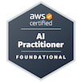

# ☁️ Maria Arpitha | Cloud Infrastructure Engineer

> “Engineering the sky—from concept to cloud, deployment to delivery.”

Hey there! I’m **Maria Arpitha**, a Cloud Infrastructure Engineer with over **3 years of experience** architecting, automating, and optimizing cloud-native environments. Whether it's writing clean infrastructure as code, designing scalable architectures, or coaching others through the cloud journey—I turn complex challenges into elegant solutions.

---

## 🧪 Certifications

---

## 🛠️ Tech Toolbox

- 🚀 **Cloud Platforms**: AWS, GCP, Azure  
- 🔧 **Infrastructure as Code**: Terraform, CloudFormation  
- 🌀 **CI/CD Pipelines**: Jenkins, AWS CodeDeploy  
- 🛡️ **Security & Governance**: IAM, Shared Responsibility Model  
- 📈 **Monitoring & Logging**: Amazon CloudWatch  
- 🧰 **Developer Tools**: Git, GitHub, JIRA  

---

## 💼 Career Journey

### 👩‍💻 Excelsoft Technologies — Mysore  
**Cloud Infrastructure Engineer** *(Jul 2021 – Feb 2023)*  
- Engineered scalable cloud infrastructure for exam platforms  
- Automated deployments via Terraform and improved uptime  
- Optimized resource usage and performance metrics  
- Troubleshot cross-stack integration and security issues

### 🎓 IIHT — Bangalore  
**AWS Cloud Trainer** *(Mar 2020 – May 2021)*  
- Led AWS learning programs for aspiring cloud engineers  
- Developed