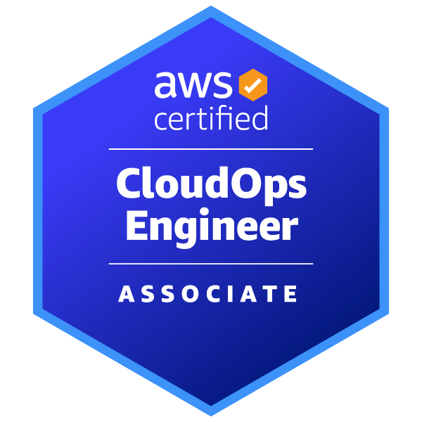
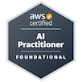
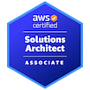
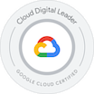
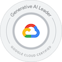

## ☁️ Maria Arpitha Sagayam | Cloud and DevOps Engineer

> “Engineering the sky—from concept to cloud, deployment to delivery.”

Hi, I'm Maria Arpitha — a Cloud & DevOps Engineer with 5+ years of AWS production experience, 6 cloud certifications and 6 hands-on projects built to production standards.

My background includes provisioning and managing AWS infrastructure using Terraform, building CI/CD pipelines with GitHub Actions and Jenkins, and designing secure multi-AZ architectures — gained through real production work at an EdTech SaaS company serving clients across the US, UK, and Southeast Asia.

Based in Bristol, CT — open to remote and hybrid roles. Fully authorized to work in the US (H4 EAD, no sponsorship required).

---

## 🏅🏆 Certifications

---

## 🛠️ Tech Toolbox

-  **Cloud Platforms**: AWS (Primary) · Azure · GCP  
-  **IaC & Automation**: Terraform · Ansible
-  **CI/CD Pipelines**: Jenkins · GitHub Actions
-  **Containers & Orchestration**: Docker · Kubernetes · ECR · EKS
-  **Security**: IAM · Secrets Manager · KMS · Security Groups  
-  **Monitoring & Observability**: Amazon CloudWatch
-  **Version Control Tools**: Git · GitHub
-  **Scripting**: Bash
-  **Operating Systems**: Linux · Windows
-  **AI Tools**: GitHub Copilot · Claude Code

---

## 📈 Career Development

### Cloud and DevOps Projects | Self-Directed | U.S. | Mar 2023 – Present

- Following relocation to the US, dedicated this period to earning 6 cloud certifications across AWS, GCP, and Azure — and building 6 production-equivalent projects to stay technically current and US market-ready. Fully authorized to work in the US (H4 EAD — no sponsorship required).

1. #### **AWS 3-Tier Production Project — EKS Migration Terraform · Docker · GitHub Actions · Kubernetes · CloudWatch**
- Provisioned complete 3-tier AWS architecture with Terraform — VPC, ALB, EKS, RDS MySQL, IAM across us-east-1a and us-east-1b — zero manual steps
- Built end-to-end GitHub Actions CI/CD pipeline — terraform plan on PR, apply on merge, Docker build, ECR push, kubectl rollout in one automated workflow
- Containerized Node.js application with Docker and pushed to ECR using IAM role authentication — no stored credentials
- Migrated compute layer from EC2/ASG to EKS — Deployment, Service, HPA (2→6 pods at 70% CPU), Kubernetes Secret for secure DB credential injection
- Implemented full CloudWatch observability — alarms, log streams, SNS alerting, custom metrics (RequestCount, Latency, ErrorCount) via AWS SDK
- Reduced deployment time from 5-10 minutes (ASG refresh) to ~30 seconds (kubectl rollout) with zero downtime

2. #### **End-to-End DevOps Pipeline — Jenkins · Docker · AWS**
- Provisioned AWS infrastructure (VPC, EC2, ALB, RDS) via AWS CLI and containerized a Java application with Docker
- Built Jenkins CI/CD pipeline with GitHub webhook triggers — every commit automatically builds, pushes Docker image to DockerHub, and deploys to EC2 with zero manual steps

3. #### **Secure Static Website — S3 · CloudFront · ACM · Route 53**
- Hosted static website on private S3 bucket with CloudFront Origin Access Control (OAC) for secure content delivery
- Configured ACM SSL certificate and Route 53 for custom domain with HTTPS — no direct S3 public access
  
4. #### **Serverless Credential Rotation — Lambda · Secrets Manager · EventBridge**
- Built serverless automation to rotate credentials in Secrets Manager using Lambda triggered by EventBridge on a schedule
- Applied least-privilege IAM policies — zero standing access to secrets

---

## 👩‍💻 Professionl Experience

### Configuration Managemnt Engineer (Cloud Infrastructure and DevOps) 
#### 🏢 Excelsoft Technologies · Mysore, India · Jul 2021 – Feb 2023  
- Provisioned and managed production AWS infrastructure (EC2, ALB, ASG, VPC, RDS, S3, Lambda, CloudWatch) using Terraform and AWS CLI.
- Built and maintained Jenkins CI/CD pipelines for automated application deployments — reducing manual release effort significantly.
- Implemented Ansible-based configuration management for automated deployments and system updates across environments.
- Enforced IAM roles, policies, and security groups following least-privilege principles across all production resources.
- Configured CloudWatch metrics, alarms, and log groups to improve infrastructure reliability and operational visibility.
- Created AMIs and golden images to standardize environments and accelerate disaster recovery.

### Cloud Infrastructure Trainee (AWS and DevOps) 
### 💻 IIHT · Bangalore, India · Mar 2020 – May 2021
- Trained junior engineers on AWS cloud fundamentals through structured hands-on labs covering EC2, S3, IAM, VPC, and RDS
- Supported development and maintenance of an internal web application, gaining practical exposure to real-world deployment workflows
- Gained foundational exposure to Terraform, Jenkins, Docker, and GitHub — forming the technical base for subsequent production roles.
  

### 📲 KGISL - Bangalore, India
#### Junior Associate (Customer Support) · Jun 2018 – Feb 2020 
- Delivered end-to-end customer support for US-based clients through high-volume inbound and outbound calls, resolving service requests with clarity, empathy, and professionalism

---

## 🎓 Education

### JSS Academy of Technical Education (JSSATE) — Bangalore, India
Bachelors of Engineering, Information Science & Engineering (ISE) · 2017
