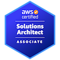
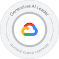

# ☁️ Maria Arpitha | Cloud and DevOps Engineer

> “Engineering the sky—from concept to cloud, deployment to delivery.”

Hey there! I’m **Maria Arpitha**, a Cloud Infrastructure Engineer with over **5+ years of experience** architecting, automating, and optimizing cloud-native environments. Whether it's writing clean infrastructure as code, designing scalable architectures, or coaching others through the cloud journey—I turn complex challenges into elegant solutions.

---

## 🏅🏆 Certifications

---

## 🛠️ Tech Toolbox

-  **Cloud Platforms**: AWS, GCP, Azure  
-  **Infrastructure as Code**: Terraform  
-  **CI/CD**: Jenkins, AWS CodeDeploy  
-  **Security & Governance**: IAM, Shared Responsibility Model  
-  **Monitoring & Logging**: Amazon CloudWatch, CloudTrail 
-  **Developer Tools**: Git, GitHub Actions
-  **Scripting**: Bash, YAML, JSON

---

## 📈 Career Journey

### 👩‍💻 PROFESSIONAL DEVELOPMENT (2023 – current) – U.S.
**Cloud and DevOps Engineer (Independent Projects & Certifications)**

- 3‑Tier AWS Project —  Architected and implemented a production‑style AWS 3‑tier environment using Terraform (VPC, ALB, EC2, RDS) with secure private‑subnet application hosting via SSM and PM2 and Automated zero‑touch deployments using GitHub Actions, S3, and SSM.
- Serverless Password Rotation — Developed an automated password-rotation system using AWS Lambda, Secrets Manager, and EventBridge. Implemented secure, KMS-encrypted secret rotation with least-privilege IAM and validated scheduled end-to-end execution.
- Automated CI/CD Pipeline — Built a fully automated CI/CD pipeline using GitHub Actions and AWS EC2, with CI handling tests, builds, and artifact packaging. Implemented zero-touch deployments to EC2 for consistent, repeatable, production-ready releases.
- Static Website Hosting on AWS — Architected and deployed a production-ready static site using S3, CloudFront, Route 53, IAM, and CloudWatch, implementing HTTPS, caching, and cost-optimized storage.
- Full DevOps Pipeline for a Full-Stack Application — Designed and deployed a complete CI/CD and infrastructure automation workflow using GitHub Actions, Terraform, AWS CLI, EC2, ALB, RDS MySQL, and CloudWatch. Built a custom VPC, provisioned compute resources, configured load balancing, and automated deployments for a scalable, production-ready environment.

### 🏢 Excelsoft Technologies — Mysore, India
**Cloud Infrastructure Engineer** *(Jul 2021 – Feb 2023)*  
- Engineered scalable cloud infrastructure for exam platforms  
- Automated deployments via Terraform and improved uptime  
- Optimized resource usage and performance metrics  
- Troubleshot cross-stack integration and security issues

### 💻 IIHT — Bangalore, India 
**AWS Cloud Trainer** *(Mar 2020 – May 2021)*  
- Led AWS learning programs for aspiring cloud interns 
- Created labs, guides, small project demo and quizzes to accelerate onboarding for new engineers
- Collaborated with senior engineers to simplify technical concepts, making them clear for both technical and non‑technical audiences

### 📲 KGISL - Bangalore, India
**Junior Associate (Tech Support)** *(Jun 2017 – Feb 2020)* 
- Delivered end-to-end customer support for US-based clients through high-volume inbound and outbound calls, resolving service requests with clarity, empathy, and professionalism

## 🎓 Education

### JSS Academy of Technical Education (JSSATE) — Bangalore, India
**Bachelors in Information Science & Engineering** *(2017)* 
